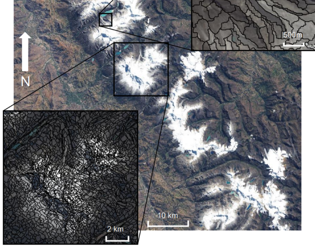
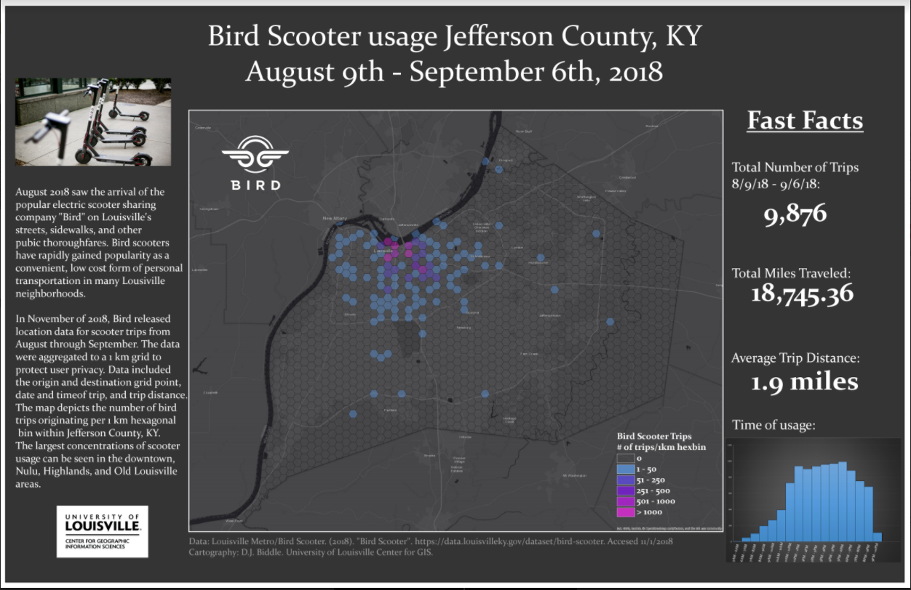

# Course Overview
## GEOG 590 - Web Mapping

### Donald J. Biddle
---
### The Plan
- Introduction
- Syllabus
- Schedule/Course Flow
- Class Slack Website
- A look ahead...
---
@title[Introduction]
### About me...

@ul
- GIS Research Manager
- University of Louisville Center for GIS
- 15 Years in GIS/Mapping
- Teach courses in GIS (including Web Mapping!)
- Support research (faculty and student)
- Technical Support to campus GIS users
@ulend
+++

@title[About Me]
### About Me
@css[fragment](I make maps...)@css[fragment](and web mapping applications...)@css[fragment](and wrangle spatial data...)@css[fragment](to create visualizations that tell a story about physical or social phenomena.)
+++

**Everything from glaciers in South America...**

+++

**To Bird Scooter usage in Louisville...**
 
+++
@css[fragment](Once upon a time, paper maps ruled the day...)@css[fragment](and GIS mapping was the sole domain of expert analysts with expensive workstations and Desktop GIS software.)
+++
@css[fragment](Access to data, analytical tools, and all the power that geospatial technology can offer was limited to organizations with the funding and resources to acquire them)
+++
@css[fragment](A case of the "haves" versus the "have nots")
+++
@css[fragment](But with the advent of the Internet and WWW...)@css[fragment](and cheaper, faster, and more capable hardware...)@css[fragment](and especially the ubiquitous smart devices with onboard GPS hardware...)
+++
@css[fragment](A **revolution** has occurred...)@css[fragment](where anyone with a smartphone can access the power of GIS, literally at their fingertips, that just 10 years ago was restricted to wealthy and specalized orgs)
+++
@css[fragment](It's not just that citizens *can* access sophisticated maps on the web...)@css[fragment](the revolution is that they now **expect** it...)@css[fragment](**demand** it...)@css[fragment](even **deserve** it?)
+++
This class aims to survey the landscape of maps and geospatial technology on the WWW today...@css[fragment](how we got here...)@css[fragment](how it works...)@css[fragment](and most importantly how **you** can start making maps and GIS applications that are served over the WWW.)
+++
The class will take a comprehensive approach to learning the art and science of web mapping
@ul
- Video Lectures |
- Selected Readings |
- Case studies |
- Lab Exercises |
- Project Work |
@ulend 
+++
### What's in a map?
 > A map is a symbolic representation of selected characteristics of a place, usually drawn on a flat surface. Maps present information about the world in a simple, visual way.
 > ###### -[National Geographic Society](https://www.nationalgeographic.org/encyclopedia/map/)
---
### What's in a map?
 > A *good* map delivers its information to the viewer in a clear and intuitive manner, in effort to convince, to present a case, or to tell a story. 
---
### What's in a map?
- [Key features of a *good* map](http://www.esri.com/news/arcuser/0112/make-maps-people-want-to-look-at.html):
 1. **Visual Contrast:** Data is the star of the show
 2. **Legibility:** Data are seen *and understood*. Selection of appropriate symbols/sizes is key.
 3. **[Figure-Ground Organization](https://blogs.esri.com/esri/arcgis/2011/02/15/graphic-design-principles-for-mapping-figure-ground-organization/):** Separation of main figure from background. 
 4. **Hierarchical Organization:** Within data layers themselves, and within map elements (title, north arrow, etc.)
 5. **Visual Balance:** Effective use of white space and positioning of visual elements within a layout .
---
### What and for Whom?
- Two most important questions you can ask when designing a map: 
 - What is the map's purpose?
 - Who is the audience? 
- The answers to these questions should shape the entire design process.
---
### Purpose
- Is your map...
 - Trying to help readers navigate roadways? 
 - Helping readers visualize terrain and topography?
 - Presenting information about the people that live in a city/state/country?
 - Showing the distribution of some phenomenon over Earth's surface? 
- Each of these purposes requires unique data, symbology, visual presentation, etc. 
- A thesis statement for your map.
---
### Audience
- Who is the primary viewership of your map?
 - The general public?
 - School children? 
 - Other geographers? 
 - The visually impaired?
- The design decisions you make should be based on assumptions about your intended audience.
- Example: Geographers will be familiar with interpreting census data in a standard deviation classification, but school children may not.  
---
### Thinking about design
- Beyond purpose and audience what are the key considerations?
 - Medium? Paper, PDF, Web? |
 - Appropriate scale? Detail vs study area extent |
 - Viewing distance? Wall map...6-9FT, Figure in paper...2FT |
 - Environment/Philosophy of use? Field map, wall map, office use |
---
### The Design Process
1. Define purpose and audience 
2. Select map scale 
3. Select medium, PoU, costs?? 
4. Abstraction/simplification of data 
 - Select, generalize, classify, symbolize 
5. Design the layout 
---
### Map Layout Elements

---
### Good Maps

---
### Good Maps

---
### Good Maps

---
### Good Maps

---
### Good Maps

---
### Bad Maps

---
### Bad Maps

---
### Bad Maps

---
### Bad Maps

---
### Designing Better Maps
> "It's all about matching perceptual dimensions with data dimensions" 
> - Cynthia Brewer
##### https://www.wired.com/2014/10/cindy-brewer-map-design/ 
--- 
### Adventures in Mapping
###### Blog by ESRI Cartographer John Nelson
###### https://adventuresinmapping.com/
---
### Closing Thoughts
###### ["Principles of Cartographic Design"](http://www.neercartography.com/principles-of-cartographic-design/)
###### of the British Cartographic Society
1. Concept before compliation
2. Hierarchy with harmony
3. Simplicity from sacrifice
4. Maximum information at minimum costs
5. Engage the emotion to engage the understanding
